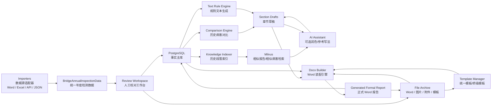
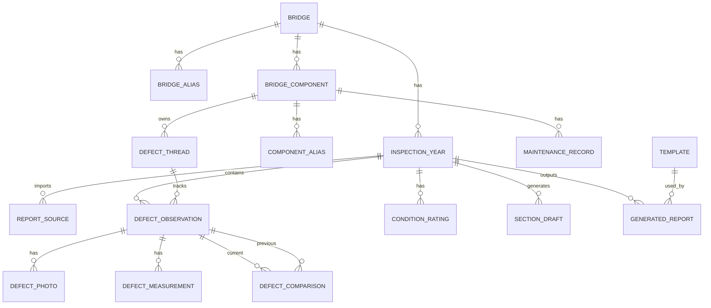
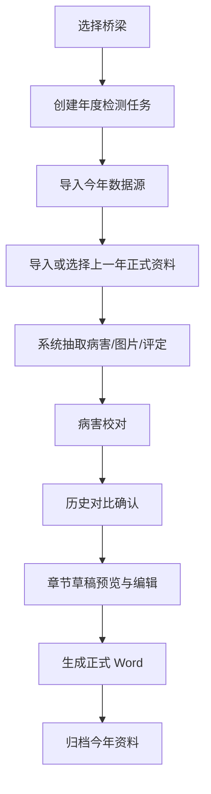

# 桥梁报告系统设计文档

日期：2026-07-01

> 2026-09-04 当前状态说明
>
> 本文保留项目立项阶段的目标、问题背景和历史决策，不再作为所有细节的最高优先级实现规格。
> 当前代码已经完成完整构件档案、合同 5.0、关系化导入解析、版本化规范和系统自主评定；这些
> 能力与本文中的“只维护出现病害的构件”“导入 Word 评分”等早期描述不一致时，以
> `PROJECT_CONTEXT.md`、数据库迁移、运行时代码和较新已确认设计为准。
>
> 报告模板与 Word 生成以
> `docs/superpowers/specs/2026-09-04-report-template-word-generation-design.md` 为当前依据。该设计
> 已明确取消报告版本管理、生成报告永久归档、直接套用上一年度正式报告和持久化章节草稿；
> Word 只是从数据库正式事实即时生成的临时下载文件。
>
> 原模块 08“章节规则生成”和模块 09“Word 模板与生成”在第一版合并为“报告模板管理与 Word
> 即时生成”。模块 07 的完整病害语义对比继续延期；第一版报告只使用
> `source_defect_count_delta_v1` 来源病害条数差。模块 10 AI/Milvus 不作为第一版报告生成前置条件。

## 1. 背景

桥梁定期检测报告目前主要靠人工整理。

1. 软件自动生成的报告里，有一部分内容可以直接使用，尤其是第二章的病害检查表、病害照片，以及第四章的全桥技术状况综合评定。
2. 上一年的正式报告保留了已经认可的报告结构、封面、固定章节、历史检测文字、对比文字、结论和版式。
3. 报告编写人员通常要把今年软件报告中可用的内容复制到上一年的正式报告里，再人工更新历史、对比、结论和相关措辞。

真正耗时间的不是 Word 排版，而是统计今年和上一年的病害变化，尤其是这些章节：

- `1.4.1 历年检测情况`
- `本桥上次检测时主要存在以下病害`
- `2.1.2 / 2.2.2 / 2.3.2 与最近一次检查结果对比`
- `5.1.1 桥梁外观检查结论`

所以，这个系统不能只做 Word 替换。它要按桥梁和年份沉淀检测资料：保存每座桥历年的报告、病害、构件、维修记录和技术状况评定，再自动生成历史对比和报告章节，最后输出完整正式 Word 报告。

## 2. 已确认决策

- 新建独立项目，不放进现有 `auto_cad` 工程。
- 第一版做成本地网页系统，先满足单机使用，同时保留后续升级到小团队协作的空间。
- PostgreSQL 是结构化事实主库。
- Word、图片、模板、附件和生成报告放在文件归档目录中，数据库只保存文件元数据和路径。
- Milvus 只用于相似报告段落、相似病害描述和历史写法检索，不作为事实主库。
- 第一阶段的主流程使用：
  - 今年软件自动生成的 Word 报告
  - 去年正式 Word 报告，或系统中已经归档的上一年度数据
- 今年数据源必须通过导入适配器抽象。后续可以替换为 Excel、API、JSON、外部数据库同步或人工录入。
- 系统最终输出完整正式 Word 报告。
- 同时支持统一标准模板和桥级模板。
- 病害事实、数量、尺寸、评分、等级、对比关系和结论由规则生成。
- AI 只用于可选文字润色，必须基于锁定的结构化事实，并且生成后要做事实校验。
- 增加构件病害档案页，展示所有曾经出现病害或维护记录的构件，包括已经修复的构件。

## 3. 目标

第一阶段先跑通一条能用于真实样例的闭环：

1. 创建或选择一座桥。
2. 创建年度检测任务。
3. 导入今年数据源。
4. 导入上一年正式报告，或选择系统中已有的上一年度资料。
5. 抽取病害表、病害照片和技术状况评定内容。
6. 校对并确认今年病害事实。
7. 如果上一年数据来自 Word 解析，也需要校对上一年病害事实。
8. 对比今年和上一年的病害变化。
9. 生成历史、对比、结论等章节草稿。
10. 可选使用 AI 润色文字，但不得改变事实。
11. 生成完整正式 Word 报告。
12. 将生成报告和确认后的结构化数据归档，作为下一年度的历史依据。

第一阶段的验收样例为 `绕阳河二号桥`：

- 今年软件报告：`绕阳河二号桥报告...docx`
- 正式报告参考：`Q202605001-JZ-024-S319辽小线绕阳河二号桥定期检测报告（2类）.docx`

## 4. 第一阶段不做的内容

第一阶段不包含：

- 完整的多人账号、权限和审签流程。
- 手机端外业采集。
- 直接对接外部桥检系统。
- 自动生成带签章的 PDF。
- 不经人工确认的一键终稿。
- 让 AI 判断病害事实、评分、等级或对比关系。
- 自动生成每座桥的完整构件台账。

构件档案第一阶段只覆盖出现过病害或维护记录的构件。完整构件台账可以后续再扩展。

## 5. 总体架构

## 6. 模块边界

### 6.1 Importers

`Importers` 负责把不同来源的数据转换成统一的中间模型：`BridgeAnnualInspectionData`。

报告生成系统不能直接依赖“今年软件自动报告 Word”。它只依赖统一年度检测数据。这样以后换成 Excel、API、JSON 或外部数据库同步时，只需要增加或替换 importer，不影响后面的校对、对比、文本生成和 Word 装配。

第一阶段实现：

- `SoftwareWordReportImporter`
  - 抽取今年报告第二章病害表。
  - 抽取病害照片和照片标题。
  - 抽取第四章全桥技术状况综合评定。
  - 尽量抽取桥梁基本信息。
- `FormalWordReportImporter`
  - 将上一年正式报告解析成历史资料。
  - 抽取历年检测表、上次主要病害、对比章节、结论和正式报告段落。
  - 解析结果默认按低置信度处理，必须进入人工校对。

后续可增加：

- `ExcelInspectionImporter`
- `ApiInspectionImporter`
- `ManualEntryImporter`
- `StructuredJsonImporter`
- `DatabaseSyncImporter`

### 6.2 BridgeAnnualInspectionData

这是 importer 和其他模块之间的稳定数据契约。

它应包含：

- 桥梁身份和别名
- 检测年份和检测日期
- 数据来源元信息
- 桥梁基本信息
- 病害观测记录
- 病害照片
- 技术状况评定数据
- 抽取出的章节文本
- 来源引用
- 抽取置信度

以后输入形式可以换，但 `BridgeAnnualInspectionData` 要尽量稳定。

### 6.3 Review Workspace

`Review Workspace` 是人工确认层。

它用于校对：

- 桥梁基本信息
- 今年病害记录
- 病害照片和照片标题
- 上一年病害记录
- 病害尺寸
- 技术状况评定
- 系统生成的对比关系
- 系统生成的章节草稿

只有人工确认或明确接受的事实，才能进入正式报告生成。

### 6.4 PostgreSQL

PostgreSQL 存结构化事实：

- 桥梁
- 桥梁别名
- 年度检测任务
- 报告来源
- 出现过病害或维护记录的构件
- 病害观测记录
- 病害尺寸
- 病害照片
- 跨年病害线索
- 病害对比关系
- 技术状况评定
- 章节草稿和版本
- 报告模板
- 生成报告
- 校对状态和审计信息

### 6.5 File Archive

文件归档目录存二进制文件和原始资料：

- 导入的软件 Word 报告
- 导入的正式 Word 报告
- 抽取出的照片
- 生成的 Word 报告
- 用户上传的最终确认版报告
- 模板
- 附件和维修记录资料

PostgreSQL 保存文件元数据、相对路径、hash、来源类型和版本。

### 6.6 Milvus

Milvus 只存语义向量，用于检索：

- 历年正式报告段落
- 已确认的对比段落
- 已确认的外观检查结论段落
- 病害描述文本
- 养护建议段落
- 成因分析段落

Milvus 不判断事实，只用于查找相似写法和历史案例。

### 6.7 Comparison Engine

`Comparison Engine` 对比不同年份的病害记录，提出候选关系：

- 延续
- 新增
- 消失
- 已修复
- 加重
- 减轻
- 不确定

它只给出候选结果，用户可以确认、拒绝或手动绑定。

### 6.8 Text Rule Engine

`Text Rule Engine` 生成事实敏感型章节：

- 历年检测情况
- 上次检测主要病害
- 上部结构对比
- 下部结构对比
- 桥面系对比
- 外观检查结论
- 部分养护建议

病害数量、尺寸、构件编号、评分和等级必须由规则生成，不能交给 AI 自由发挥。

### 6.9 AI Assistant

AI 可以接入，但必须受控。

AI 可以：

- 润色已经由规则生成并确认事实的段落。
- 提供相似历史写法。
- 基于确认事实生成成因分析候选文字。
- 基于确认事实生成养护建议候选文字。

AI 不能：

- 创造病害记录。
- 修改病害数量、尺寸、构件编号或等级。
- 判断对比关系。
- 静默修改最终报告内容。

### 6.10 Template Manager 与 Docx Builder

`Template Manager` 负责：

- 统一标准模板
- 桥级模板
- 模板清单
- 占位符或章节替换规则

`Docx Builder` 根据以下内容生成正式报告：

- 模板
- 已确认结构化事实
- 章节草稿
- 抽取出的表格和照片
- 技术状况评定内容

## 7. 核心数据模型

### 7.1 实体概览

### 7.2 Bridge

`Bridge` 存桥梁稳定信息：

- 桥梁名称
- 路线编号
- 路线名称
- 桥位桩号
- 行政区划
- 桥梁编码
- 桥长
- 跨径组合
- 全宽
- 主跨结构
- 桥台、桥墩及基础类型
- 桥梁别名

需要支持别名，因为不同报告里的名称可能不一致，例如：

- `绕阳河二号桥`
- `辽小线绕阳河二号桥`
- `S319辽小线绕阳河二号桥`

### 7.3 InspectionYear

`InspectionYear` 表示某座桥的一年或一次检测任务。

字段包括：

- 桥梁 id
- 检测年份
- 检测日期
- 项目名称
- 检测单位
- 报告状态
- 全桥评分
- 全桥等级
- 上部结构等级
- 下部结构等级
- 桥面系等级
- 校对状态
- 报告生成状态

### 7.4 ReportSource

`ReportSource` 表示导入来源资料。

字段包括：

- 来源类型
- importer 类型
- 原始文件 id
- 抽取结果摘要
- 解析 warning
- 解析 error
- 抽取时间
- 抽取置信度摘要

每条病害、照片、评分和章节草稿都应能追溯到来源文件或来源段落。

### 7.5 BridgeComponent

`BridgeComponent` 表示出现过病害或维护记录的构件。

第一阶段只保存有病害或维护记录的构件，不强行生成完整构件树。

字段包括：

- 桥梁 id
- 结构分组：上部结构、下部结构、桥面系
- 部件名称
- 构件编号
- 位置描述
- 规范化构件 key
- 别名
- 当前状态

示例：

- `1-1#板`
- `2-1#板`
- `2-1#铰缝`
- `2#台左侧翼墙`
- `0#台帽`
- `1#墩盖梁`

### 7.6 DefectObservation

`DefectObservation` 表示某一年检测中观察到的一条病害记录。

字段包括：

- 年度检测 id
- 桥梁构件 id
- 结构分组
- 部件名称
- 构件编号
- 病害位置
- 病害类型
- 病害特征原文
- 规范化病害描述
- 标度
- 扣分
- 构件评分
- 是否已修复
- 备注
- 来源行或来源段落
- 抽取置信度
- 校对状态

### 7.7 DefectMeasurement

`DefectMeasurement` 存病害尺寸和数量信息：

- 尺寸类型：长度、宽度、面积、数量、间距、深度
- 数值
- 单位
- 原文
- 规范化数值

示例：

- `L=1.2m`
- `W=0.15mm`
- `S=0.6×0.1m²`
- `3条`
- `间距D=0.15m`

### 7.8 DefectPhoto

`DefectPhoto` 存照片引用：

- 照片编号
- 照片标题
- 图片文件 id
- 来源报告 id
- 关联病害记录
- 页码、表格或段落来源

### 7.9 DefectThread

`DefectThread` 表示跨年份追踪的同一处或同一类持续病害。

它和 `DefectObservation` 是两层概念。

示例：

- 2024 年：`2-1#铰缝勾缝砂浆脱落`
- 2026 年：`2-1#铰缝勾缝砂浆脱落`
- 两条年度观测记录可以归到同一个 `DefectThread`。

### 7.10 DefectComparison

`DefectComparison` 表示上一年和今年病害之间的对比关系。

关系类型包括：

- 延续
- 新增
- 消失
- 已修复
- 加重
- 减轻
- 不确定

字段包括：

- 上一年病害记录 id
- 今年病害记录 id
- 对比类型
- 置信度
- 原因摘要
- 规则证据
- 人工确认状态

### 7.11 MaintenanceRecord

`MaintenanceRecord` 存维护和维修记录：

- 桥梁构件 id
- 关联病害线索 id
- 维修日期
- 维修类型
- 维修方式
- 维修前后状态
- 附件
- 来源报告或人工录入记录

### 7.12 ConditionRating

`ConditionRating` 存第四章技术状况评定：

- 部件或构件名称
- 权重
- 评分
- 等级
- 评定标度
- 扣分
- 单项控制指标
- 综合评定结论

### 7.13 SectionDraft

`SectionDraft` 存系统生成和人工编辑后的章节文本。

字段包括：

- 章节 key，例如 `history_summary`、`upper_comparison`、`appearance_conclusion`
- 生成文本
- 规则来源
- AI 来源，如果使用 AI
- 关联事实
- 校对状态
- 版本
- 确认文本

## 8. 构件病害档案页

构件病害档案页用于集中查看桥梁构件的病害和维护历史。

选中一座桥后，系统展示所有曾经出现过病害或维护记录的构件，包括已修复构件。

### 8.1 构件列表

列表支持按以下条件筛选：

- 结构分组
- 部件名称
- 当前状态
- 病害类型
- 年份范围
- 是否已修复

每一行显示：

- 构件编号
- 结构分组
- 最新病害摘要
- 首次发现年份
- 最近发现年份
- 当前状态
- 病害线索数量
- 维护记录数量

### 8.2 构件详情

点选某个构件后，进入详情页，展示：

- 病害时间轴
- 维护时间轴
- 历年观测记录
- 照片
- 尺寸变化
- 对比状态
- 报告引用
- 原始来源

### 8.3 页面作用

有了这个页面，系统写历史病害和对比结论时，不必只靠两份报告的文字对比，还可以直接使用构件生命周期里的事实数据。

## 9. 历史病害对比

`Comparison Engine` 先生成候选匹配，再交给用户确认。

匹配因素：

1. 结构分组相同。
2. 部件名称相近。
3. 构件编号相同或相邻。
4. 病害类型相同或同义。
5. 位置描述相近。
6. 尺寸变化合理。
7. 普通文本相似度或 Milvus 检索结果相近。

对比输出包括：

- 候选病害对
- 建议关系
- 置信度
- 解释
- 证据

人工校对时可以：

- 确认
- 拒绝
- 标为不确定
- 手动把两条观测记录绑定到同一个病害线索
- 拆分错误绑定的病害线索

## 10. 章节生成规则

### 10.1 `1.4.1 历年检测情况`

从已确认的历史检测记录生成。

内容应包括：

- 自某一年以来的检测次数
- 历次检测日期
- 历次检测单位
- 历次总体技术状况等级
- 历年检测情况表
- 上次检测主要病害，按上部结构、下部结构、桥面系分组

### 10.2 上次检测主要病害

从上一年度已确认病害记录生成。

按以下分组：

- 上部结构
- 下部结构
- 桥面系

系统应汇总：

- 构件编号
- 病害类型
- 数量
- 总长度
- 最大宽度
- 总面积
- 已知修复状态

### 10.3 与最近一次检查结果对比

每个结构分组生成一段：

- `2.1.2 上部结构与最近一次检查结果对比`
- `2.2.2 下部结构与最近一次检查结果对比`
- `2.3.2 桥面系与最近一次检查结果对比`

每段包括：

1. 上次检测主要病害。
2. 本次对比结果。

对比结果应说明：

- 新增病害
- 延续病害
- 已修复病害
- 消失病害
- 加重病害
- 减轻病害
- 需要人工措辞的不确定情况

### 10.4 `5.1.1 桥梁外观检查结论`

从今年已确认病害生成。

规则：

- 按上部结构、下部结构、桥面系分组。
- 按部件名称和病害类型汇总。
- 保留重要构件编号。
- 汇总数量、总长度、最大宽度和总面积。
- 不直接照抄病害表原文。

## 11. Word 模板与报告生成

### 11.1 模板类型

系统支持：

- 统一标准模板
- 基于上一年正式报告的桥级模板

标准模板应尽量使用明确占位符。

桥级旧报告模板如果没有占位符，可以使用章节标题识别替换。

### 11.2 Template Manifest

每个模板应有一份模板清单，描述可替换内容：

- 桥梁基本信息表
- 历年检测情况
- 上次主要病害
- 病害检查表
- 病害照片
- 与最近一次检查结果对比
- 全桥技术状况综合评定
- 外观检查结论
- 养护建议

### 11.3 替换策略

本节原方案已被 2026-09-04 报告设计替代。当前只支持经过契约校验的干净模板：短文本使用标量占位符，动态章节使用语义锚点。生成器按锚点在模板中的实际位置装配，不再把上一年度正式报告作为模板，也不靠章节标题猜测替换位置。

### 11.4 报告版本（方案已取消）

系统只负责即时生成临时 Word 下载文件，不建立 `draft`、`reviewed`、`final` 报告版本，也不永久归档生成物。下一年度继续以数据库中的结构化正式事实为依据，详见 `2026-09-04-report-template-word-generation-design.md`。

## 12. AI 与 Milvus 边界

AI 不能创造病害事实。

### 12.1 AI 可以做什么

- 在不改变事实的前提下润色规则生成的段落。
- 根据相似历史报告给出写法参考。
- 基于已确认事实生成成因分析草稿。
- 基于已确认事实生成养护建议草稿。

### 12.2 AI 不能做什么

- 创建病害记录。
- 修改构件编号。
- 修改病害数量。
- 修改病害尺寸。
- 修改评分和等级。
- 判断病害对比关系。
- 不经审核直接写入最终报告。

### 12.3 事实锁定

传给 AI 的内容应使用结构化 JSON：

- 构件编号
- 病害类型
- 尺寸
- 数量
- 评分和等级
- 对比关系

提示词必须明确要求保留事实，不允许新增或改写事实。

### 12.4 生成后事实校验

AI 生成后，系统应校验：

- AI 文本里的每个构件编号都能在结构化事实中找到。
- AI 文本里的每个数量都能在结构化事实中找到。
- AI 文本里的每个尺寸都能在结构化事实中找到。
- AI 文本里的每个等级都能在结构化事实中找到。

无法匹配的内容需要标红，交给人工确认。

## 13. 第一阶段页面

第一阶段主要页面：

- 桥梁档案
- 构件病害档案
- 年度检测任务
- 导入任务
- 病害校对
- 历史对比确认
- 章节草稿
- 报告生成
- 模板管理

### 13.1 推荐流程

## 14. 第一阶段验收标准

以 `绕阳河二号桥` 样例为准：

1. 系统可以创建桥梁档案和年度检测任务。
2. 系统可以导入今年软件自动生成 Word 报告。
3. 系统可以导入正式报告参考文件。
4. 系统可以抽取今年病害表和照片。
5. 系统可以抽取或辅助抽取上一年主要病害。
6. 用户可以校对并确认病害记录。
7. 构件病害档案页可以展示有病害或维护记录的构件。
8. 系统可以提出上部结构、下部结构、桥面系的对比关系。
9. 用户可以确认或编辑对比关系。
10. 系统可以生成以下章节草稿：
    - `1.4.1 历年检测情况`
    - 上次检测主要病害
    - `2.1.2 与最近一次检查结果对比`
    - `2.2.2 与最近一次检查结果对比`
    - `2.3.2 与最近一次检查结果对比`
    - `5.1.1 桥梁外观检查结论`
11. 系统可以使用标准模板或桥级上一年报告模板生成完整正式 Word 报告。
12. 生成报告和确认后的年度数据可以归档，供后续年份使用。

## 15. 风险与处理

### 15.1 Word 报告解析不稳定

风险：

不同报告里的标题、表格、合并单元格、照片标题和图片布局可能不一致。

处理：

- 按 importer 写专门解析规则。
- 保存解析置信度。
- 在校对工作台展示抽取结果。
- 使用前允许人工修正。

### 15.2 构件名称不一致

风险：

同一构件可能被写成 `2-1#板`、`2- 1号板` 或其他形式。

处理：

- 保存构件别名。
- 生成规范化构件 key。
- 允许人工绑定别名。
- 不确定匹配必须保留给人工确认。

### 15.3 病害对比可能出错

风险：

系统可能把病害误判为延续或新增。

处理：

- 只生成候选，不直接定稿。
- 低置信度匹配必须确认。
- 展示匹配证据。
- 允许人工绑定和拆分。

### 15.4 AI 可能引入无依据事实

风险：

AI 可能增加病害事实或修改数量。

处理：

- 使用锁定事实的 JSON 提示词。
- 做生成后事实校验。
- AI 文本标记为草稿。
- 必须人工确认。

### 15.5 范围容易扩大

风险：

系统可能还没跑通报告生成，就被扩展成完整的桥梁资产管理系统。

处理：

- 第一阶段聚焦报告生成和病害历史。
- 构件档案先只包含出现病害或维护记录的构件。
- 完整构件台账、多人审查后续再做。

## 16. 推荐开发顺序

1. 创建独立项目骨架。
2. 定义 PostgreSQL 表结构和文件归档目录。
3. 实现 `BridgeAnnualInspectionData`。
4. 实现文件导入和来源归档。
5. 针对样例实现软件 Word 报告 importer。
6. 实现正式 Word 报告 importer，用于历史数据辅助入库。
7. 实现病害校对页面。
8. 实现构件病害档案页面。
9. 实现对比引擎和对比确认页面。
10. 实现章节草稿生成。
11. 实现 Word 模板生成。
12. 增加已确认报告段落的 Milvus 索引。
13. 增加带事实校验的 AI 润色能力。

## 17. 设计原则摘要

- 输入形式可以变化，年度结构化数据模型要稳定。
- PostgreSQL 是事实主库。
- 文件保存在归档目录，元数据保存在 PostgreSQL。
- Milvus 只做检索支持，不存事实。
- AI 只润色文字，不决定事实。
- 先确认事实，再生成文字。
- 先确认对比关系，再生成报告。
- 每段生成文字都应能追溯到结构化事实。
- 构件病害历史属于基础档案，不是附带功能。
