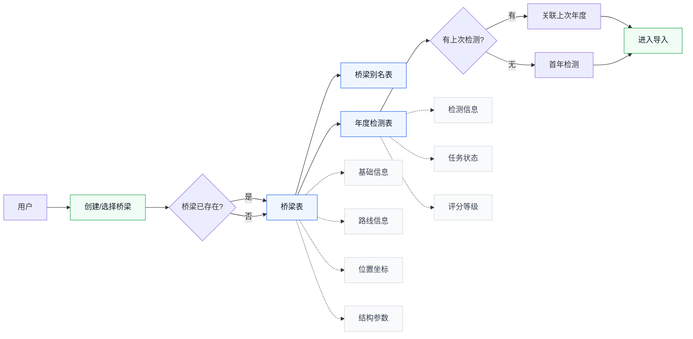
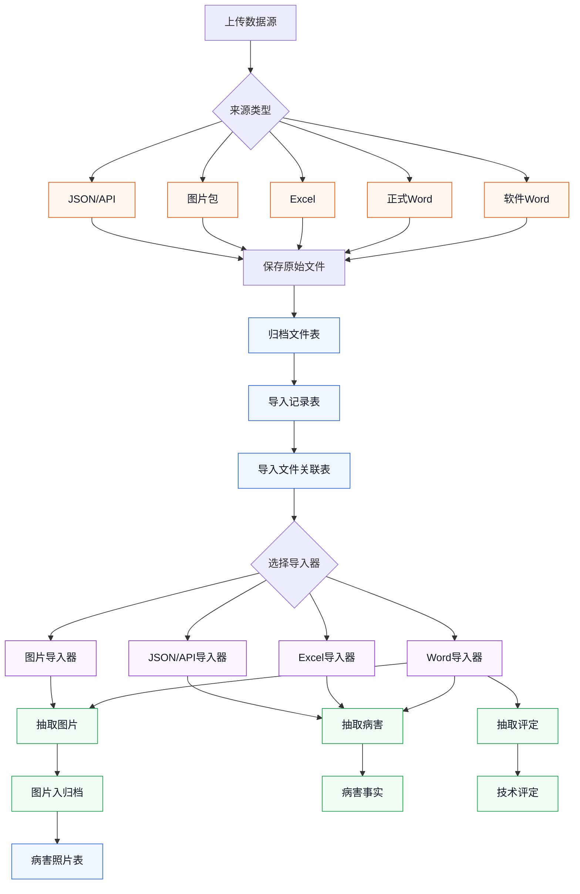
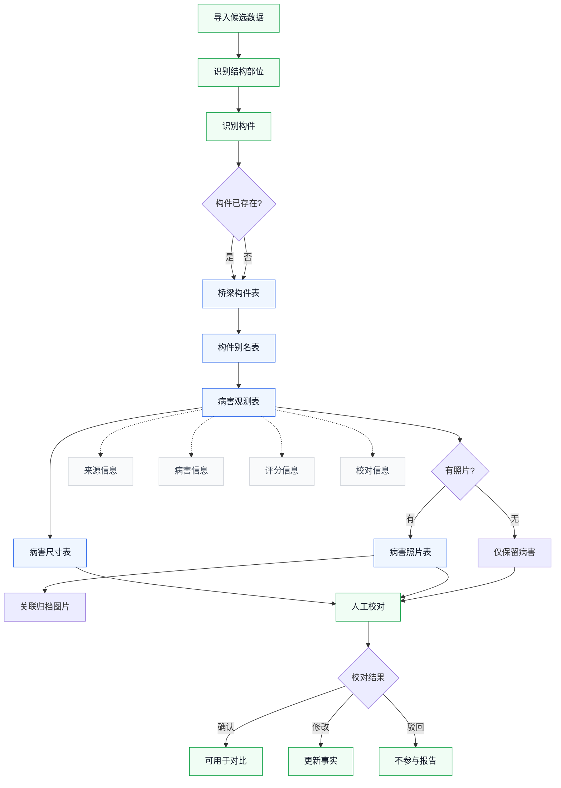
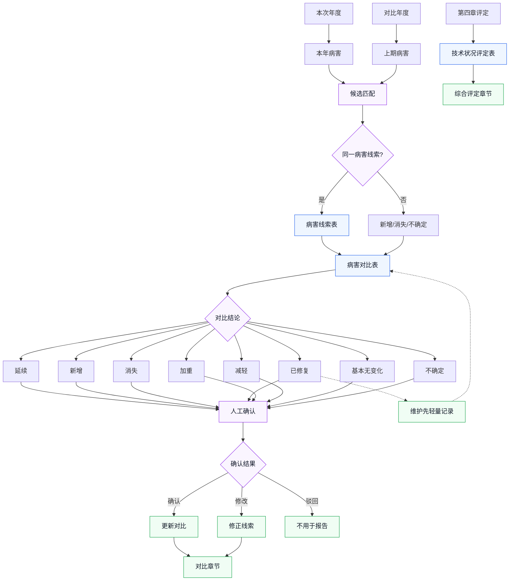

# 模块 2：核心表流程框架图

记录时间：2026-07-02

## 说明

本文保存本轮关于 PostgreSQL 核心表设计的流程框架图讨论结果。

图中只保留短标签，字段细节放在图后说明，避免框内文字过多。

当前核心表按四部分组织：

1. 桥梁与年度任务。
2. 文件归档与导入来源。
3. 构件与病害事实。
4. 评定、对比与维护。

已确认取舍：

- 桥梁主表增加经度、纬度。
- 状态值、类型值、枚举值使用中文。
- 导入文件关联表只记录用户原始输入文件。
- Word 内抽取图片只进入归档文件表，再由病害照片表关联具体病害。
- 第二模块保留病害线索表。
- 病害对比按本次年度检测编号和对比年度检测编号区分年份。
- 第一阶段不单独建维护记录表，通过病害对比表的对比结论、变化说明、人工备注表达维护相关判断。

## 1. 桥梁与年度任务



字段分组：

```text
桥梁表：
基础信息：桥梁名称、桥梁编码、行政区划
路线信息：路线编号、路线名称、桥位桩号
位置坐标：经度、纬度
结构参数：桥长、桥宽、跨径组合、结构类型、桥墩、桥台、基础类型

年度检测表：
检测信息：检测年份、检测日期、项目名称、检测单位、报告编号
任务状态：草稿、导入中、待校对、已确认、已归档
评分等级：全桥评分、全桥等级、上部结构等级、下部结构等级、桥面系等级
```

### 表数据示例

下面用 `绕阳河二号桥 2026 年定期检测` 举例。示例编号使用便于阅读的写法，实际数据库可以使用 UUID 或自增编号。

#### 桥梁表

这张表存“一座真实桥梁”的稳定档案。不同年份、不同报告都应指向同一条桥梁记录。

```text
桥梁编号：QL-001
桥梁名称：绕阳河二号桥
桥梁编码：Q202605001-JZ-024
路线编号：S319
路线名称：辽小线
桥位桩号：K24+xxx
行政区划：辽宁省某市某区
经度：121.123456
纬度：41.123456
桥长：86.00m
桥宽：12.00m
跨径组合：3×20m
结构类型：预应力混凝土空心板桥
桥墩类型：柱式墩
桥台类型：肋板台
基础类型：桩基础
状态：在用
创建时间：2026-07-02 10:00:00
更新时间：2026-07-02 10:00:00
```

这条记录回答的是：系统里这座桥是谁，在哪里，基本结构是什么。

#### 桥梁别名表

这张表解决“同一座桥在不同报告里名字不一致”的问题。

```text
别名编号：QLBM-001
桥梁编号：QL-001
别名名称：S319辽小线绕阳河二号桥
来源类型：导入识别
来源文件编号：GDWJ-001
识别置信度：0.92
是否人工确认：是
创建时间：2026-07-02 10:05:00
```

如果另一个报告写成 `辽小线绕阳河二号桥`，也可以再加一条别名。这样导入时系统能把不同叫法归并到同一座桥。

#### 年度检测表

这张表存“某座桥某一年或某一次检测任务”。

```text
年度检测编号：NDJC-2026-001
桥梁编号：QL-001
检测年份：2026
检测日期：2026-05-12
项目名称：S319辽小线绕阳河二号桥定期检测
检测单位：某某检测有限公司
报告编号：Q202605001-JZ-024
上次年度检测编号：NDJC-2025-001
任务状态：待校对
校对状态：部分校对
全桥评分：88.5
全桥等级：2类
上部结构等级：2类
下部结构等级：1类
桥面系等级：2类
创建时间：2026-07-02 10:10:00
更新时间：2026-07-02 11:30:00
```

这条记录后面会被导入记录、病害观测、技术评定、病害对比共同引用。比如 2026 年报告和 2025 年报告做对比时，`本次年度检测编号` 就是 `NDJC-2026-001`，`对比年度检测编号` 就是 `NDJC-2025-001`。

## 2. 文件归档与导入来源



边界说明：

```text
归档文件表：
存所有文件，包括原始 Word、Excel、图片包、抽取图片、生成报告、模板。

导入记录表：
存一次导入动作，比如“绕阳河二号桥 2026 软件Word导入”。

导入文件关联表：
只挂用户原始输入文件，不挂 Word 内抽取出来的图片。

抽取图片：
只进入归档文件表，再由病害照片表关联具体病害。
```

### 表数据示例

这一部分的核心是：文件本体放在 `archive/` 目录，数据库只存文件元数据、导入动作和文件角色。

#### 归档文件表

这张表存所有文件的档案，包括用户上传的原始 Word、后续 Excel、图片包、接口快照，以及从 Word 里抽取出来的图片。

```text
文件编号：GDWJ-001
桥梁编号：QL-001
年度检测编号：NDJC-2026-001
原始文件名：绕阳河二号桥报告.docx
存储相对路径：archive/2026/绕阳河二号桥/import-0001/绕阳河二号桥报告.docx
文件类型：Word文档
文件用途：本次数据源
文件扩展名：docx
文件大小：18.6MB
文件哈希：a8b7...9f21
上传时间：2026-07-02 10:20:00
备注：软件自动导出的本年检测报告
```

从 Word 中抽取出来的图片也进入这张表，但它不是用户原始输入文件：

```text
文件编号：GDWJ-002
桥梁编号：QL-001
年度检测编号：NDJC-2026-001
原始文件名：image001.png
存储相对路径：archive/2026/绕阳河二号桥/import-0001/extracted-images/image001.png
文件类型：图片
文件用途：病害照片
文件扩展名：png
文件大小：642KB
文件哈希：c3d1...771a
上传时间：2026-07-02 10:22:00
备注：从软件 Word 报告中抽取
```

这样做的好处是：无论文件来自 Word、Excel、图片包，还是以后接口同步产生的 JSON 快照，都能在一个统一文件档案里管理。

#### 导入记录表

这张表存“一次导入动作”。它不存具体病害，只记录这次导入什么时候开始、用什么导入器、结果如何。

```text
导入记录编号：DRJL-001
年度检测编号：NDJC-2026-001
导入名称：绕阳河二号桥 2026 软件Word导入
数据来源类型：软件导出Word
导入状态：待校对
主文件编号：GDWJ-001
导入器名称：软件Word报告导入器
导入器版本：2026.07.02
开始时间：2026-07-02 10:21:00
结束时间：2026-07-02 10:25:00
错误信息：空
警告摘要：识别到 2 张图片标题不完整，需人工确认
解析摘要：抽取病害 18 条，抽取图片 26 张，抽取技术评定 4 项
创建时间：2026-07-02 10:20:30
备注：第一版样例导入
```

以后如果换成 Excel，表结构不用改，只换这些值：

```text
数据来源类型：Excel病害表
导入器名称：Excel病害表导入器
```

如果以后接外部接口：

```text
数据来源类型：接口同步
导入器名称：外部桥检系统同步导入器
```

#### 导入文件关联表

这张表说明“这次导入用了哪些用户原始输入文件”。它只挂用户上传或系统接收的原始输入，不挂从 Word 内抽取出来的图片。

```text
关联编号：DRWJ-001
导入记录编号：DRJL-001
归档文件编号：GDWJ-001
文件角色：主报告
处理状态：处理成功
处理说明：作为软件 Word 主报告解析
创建时间：2026-07-02 10:21:00
```

如果以后用户上传 Excel 加图片包，可以是：

```text
关联编号：DRWJ-010
导入记录编号：DRJL-010
归档文件编号：GDWJ-050
文件角色：病害表
处理状态：处理成功

关联编号：DRWJ-011
导入记录编号：DRJL-010
归档文件编号：GDWJ-051
文件角色：图片压缩包
处理状态：处理成功
```

这就预留了多格式导入能力：一个导入记录可以挂多个原始文件，每个文件有自己的角色。

## 3. 构件与病害事实



字段分组：

```text
桥梁构件表：
桥梁编号、结构部位、构件类型、构件编码、位置描述、规范化构件键、当前状态。

病害观测表：
来源信息：来源导入记录、来源文件、页码、表格、行号、来源原文
病害信息：结构部位、构件类型、构件编码、病害类型、位置、原始描述、规范化描述
评分信息：标度、扣分、构件评分、是否已修复
校对信息：抽取置信度、校对状态、校对备注

病害尺寸表：
尺寸类型、数值、单位、原始文本、规范化文本。

病害照片表：
病害观测编号、归档文件编号、照片编号、照片标题、照片说明。
```

### 表数据示例

这一部分存的是报告里最核心的事实：哪个构件、出现了什么病害、尺寸是多少、对应哪张照片。

#### 桥梁构件表

这张表第一阶段只存出现过病害或维护记录的构件，不强行建完整构件台账。

```text
构件编号：GJ-001
桥梁编号：QL-001
结构部位：上部结构
构件类型：空心板
构件编码：2-1#板
位置描述：第2跨第1片板
规范化构件键：上部结构/空心板/2-1#板
当前状态：在用
创建时间：2026-07-02 10:26:00
更新时间：2026-07-02 10:26:00
```

这条记录后续会被病害观测、病害线索、病害对比共同引用。

#### 构件别名表

这张表解决构件写法不一致的问题。

```text
别名编号：GJBM-001
构件编号：GJ-001
别名文本：2-1号板
来源文件编号：GDWJ-001
识别置信度：0.86
是否人工确认：是
创建时间：2026-07-02 10:27:00
```

比如上一年报告写 `2-1号板`，今年报告写 `2-1#板`，人工确认后都指向 `GJ-001`。

#### 病害观测表

这张表表示“某一年检测报告里观察到的一条病害”。同一处病害 2025 年和 2026 年会各有一条观测记录。

```text
病害观测编号：BHGC-2026-001
年度检测编号：NDJC-2026-001
桥梁编号：QL-001
构件编号：GJ-001
病害线索编号：BHXS-001
来源导入记录编号：DRJL-001
来源文件编号：GDWJ-001
来源页码：第 12 页
来源表格：表 2.1 上部结构检查结果
来源行号：第 5 行
来源原文：2-1#板底板发现纵向裂缝1条，长1.4m，最大宽度0.18mm。
结构部位：上部结构
构件类型：空心板
构件编码：2-1#板
病害类型：纵向裂缝
病害位置：底板
原始描述：纵向裂缝1条，长1.4m，最大宽度0.18mm
规范化描述：2-1#板底板纵向裂缝，1条，长1.4m，最大宽度0.18mm
标度：2
扣分：10
构件评分：85.0
是否已修复：否
抽取置信度：0.91
校对状态：待校对
校对备注：等待人工核对裂缝宽度
创建时间：2026-07-02 10:28:00
更新时间：2026-07-02 10:28:00
```

如果人工确认后，`校对状态` 可以改为：

```text
校对状态：已确认
校对备注：与原报告一致
```

如果系统误识别，把照片标题当成病害，也可以保留记录并标为：

```text
校对状态：已驳回
校对备注：该行不是病害记录
```

#### 病害尺寸表

一条病害可能有多个尺寸，所以单独拆表。比如同一条裂缝既有长度，也有最大宽度。

```text
尺寸编号：BHCC-001
病害观测编号：BHGC-2026-001
尺寸类型：长度
数值：1.4
单位：m
原始文本：长1.4m
规范化文本：长度=1.4m
创建时间：2026-07-02 10:28:30
```

```text
尺寸编号：BHCC-002
病害观测编号：BHGC-2026-001
尺寸类型：最大宽度
数值：0.18
单位：mm
原始文本：最大宽度0.18mm
规范化文本：最大宽度=0.18mm
创建时间：2026-07-02 10:28:30
```

如果是面积类病害，可以这样存：

```text
尺寸类型：面积
数值：0.36
单位：m2
原始文本：0.6m×0.6m
规范化文本：面积=0.36m2
```

#### 病害照片表

这张表把病害和归档图片关联起来。

```text
照片关联编号：BHZP-001
病害观测编号：BHGC-2026-001
归档文件编号：GDWJ-002
来源导入记录编号：DRJL-001
来源文件编号：GDWJ-001
照片编号：P-12
照片标题：2-1#板底板纵向裂缝
照片说明：从软件 Word 报告中抽取，需人工确认是否对应该病害
创建时间：2026-07-02 10:29:00
```

注意这里的 `归档文件编号` 指向抽取出来的图片 `GDWJ-002`；`来源文件编号` 指向原始 Word `GDWJ-001`。这样既知道照片文件在哪里，也知道它来自哪份报告。

## 4. 评定、对比与维护



关键字段：

```text
技术状况评定表：
年度检测、来源导入、来源文件、页码、评定层级、结构部位、构件、项目名称、评分、等级、权重、扣分、评定原文、校对状态。

病害线索表：
桥梁、构件、线索名称、病害类型、病害位置、首次发现年度、最近出现年度、当前状态、确认状态。

病害对比表：
桥梁、病害线索、本次年度检测、对比年度检测、上期病害、本期病害、对比结论、变化说明、置信度、匹配依据、确认状态、人工备注、生成时间、确认时间。

维护处理：
第一阶段不单独建维护记录表。
通过“对比结论=已修复”加“变化说明/人工备注”表达。
后续需要完整维修档案时，再单独扩展维护记录表。
```

### 表数据示例

这一部分存技术状况评定、跨年病害线索和年度之间的对比结论。

#### 技术状况评定表

这张表存第四章综合评定中的结构化数据。

```text
评定编号：JSPD-2026-001
年度检测编号：NDJC-2026-001
来源导入记录编号：DRJL-001
来源文件编号：GDWJ-001
来源页码：第 35 页
评定层级：全桥
结构部位：全桥
构件编号：空
评定项目名称：全桥技术状况
评分：88.5
等级：2类
权重：空
扣分：空
评定原文：经综合评定，本桥技术状况等级为2类。
校对状态：待校对
备注：由第四章综合评定表抽取
创建时间：2026-07-02 10:35:00
更新时间：2026-07-02 10:35:00
```

结构分部也可以单独存：

```text
评定编号：JSPD-2026-002
年度检测编号：NDJC-2026-001
评定层级：结构分部
结构部位：上部结构
评定项目名称：上部结构技术状况
评分：86.0
等级：2类
评定原文：上部结构技术状况等级为2类。
校对状态：待校对
```

这样生成综合评定章节时，不需要从 Word 里重新找数据，直接读结构化评定即可。

#### 病害线索表

这张表表示跨年份追踪的“同一处或同一类持续病害”。它不是某一年报告里的单条病害，而是一条长期线索。

```text
病害线索编号：BHXS-001
桥梁编号：QL-001
构件编号：GJ-001
线索名称：2-1#板底板纵向裂缝
病害类型：纵向裂缝
病害位置：底板
首次发现年度检测编号：NDJC-2025-001
最近出现年度检测编号：NDJC-2026-001
当前状态：持续存在
确认状态：人工已确认
备注：2025 年和 2026 年均发现同位置裂缝
创建时间：2026-07-02 10:40:00
更新时间：2026-07-02 10:45:00
```

它把多年的病害观测串起来：

```text
2025 病害观测：BHGC-2025-008，长1.0m，宽0.15mm
2026 病害观测：BHGC-2026-001，长1.4m，宽0.18mm
共同病害线索：BHXS-001
```

#### 病害对比表

这张表存两个年度之间的对比关系。年份区别靠 `本次年度检测编号` 和 `对比年度检测编号`，不是靠普通生成时间。

```text
病害对比编号：BHDB-2026-001
桥梁编号：QL-001
病害线索编号：BHXS-001
本次年度检测编号：NDJC-2026-001
对比年度检测编号：NDJC-2025-001
上期病害观测编号：BHGC-2025-008
本期病害观测编号：BHGC-2026-001
对比结论：加重
变化说明：同一构件同位置纵向裂缝，长度由1.0m增加至1.4m，最大宽度由0.15mm增加至0.18mm。
系统建议置信度：0.88
匹配依据：构件相同；病害类型相同；位置描述相近；尺寸变化合理
确认状态：待确认
人工备注：需人工核对照片是否为同一处裂缝
生成时间：2026-07-02 10:45:00
确认时间：空
创建时间：2026-07-02 10:45:00
更新时间：2026-07-02 10:45:00
```

新增病害示例：

```text
病害对比编号：BHDB-2026-002
桥梁编号：QL-001
病害线索编号：BHXS-002
本次年度检测编号：NDJC-2026-001
对比年度检测编号：NDJC-2025-001
上期病害观测编号：空
本期病害观测编号：BHGC-2026-010
对比结论：新增
变化说明：上期报告未见该构件该类病害，本期新发现。
确认状态：待确认
```

已修复或消失示例：

```text
病害对比编号：BHDB-2026-003
桥梁编号：QL-001
病害线索编号：BHXS-003
本次年度检测编号：NDJC-2026-001
对比年度检测编号：NDJC-2025-001
上期病害观测编号：BHGC-2025-014
本期病害观测编号：空
对比结论：已修复
变化说明：上期存在该病害，本期同位置未见该病害。
确认状态：人工已确认
人工备注：报告未明确维修日期，先按已修复记录，不建独立维护记录。
```

如果只是报告里没写清楚，不能确定是否维修，则可以写：

```text
对比结论：不确定
变化说明：上期存在，本期未识别到同位置记录，但缺少维修依据。
人工备注：需要人工查看原始报告照片和现场说明。
```

## 年份区分原则

病害对比表不靠普通时间字段区分业务年度，而靠：

```text
本次年度检测编号
对比年度检测编号
```

示例：

```text
2026 年报告对比 2025 年：
本次年度检测编号 = 2026 年检测
对比年度检测编号 = 2025 年检测

2027 年报告对比 2026 年：
本次年度检测编号 = 2027 年检测
对比年度检测编号 = 2026 年检测
```

`生成时间` 只记录这条对比记录什么时候生成，不代表业务年份。
