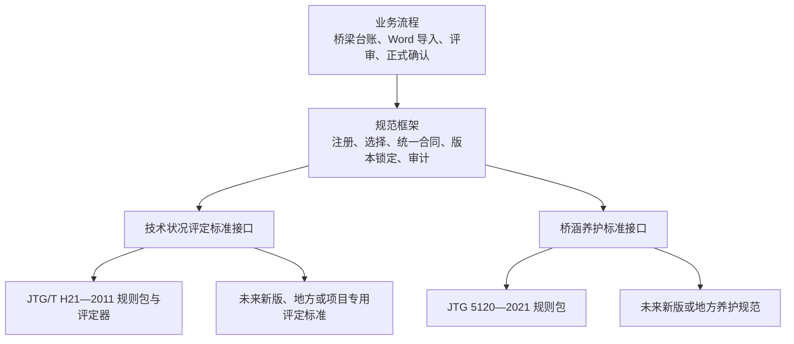

# 版本化桥梁规范模块与系统自主评定设计

## 1. 文档信息

- 日期：2026-07-17
- 状态：已确认并实施；当前运行时以迁移 010～029、规范包和正式 `assessment_run` 为准
- 当前分支：`codex/06-5-interaction-redesign`
- 设计范围：规范模块化、构件台账、系统自主评分、病害人工增删、尺寸范围结构化和相关性能边界
- 非本设计范围：模块 07

## 2. 背景

当前系统中的规范相关逻辑分散在 Python 导入器、TypeScript 前端和 C++ 后端中。以 JTG/T H21—2011 构件评分为例，同一领域规则存在多语言实现，规范更新或缺陷修正时容易产生结果漂移。

当前 Word 导入流程还会读取报告中的评分候选。新的业务目标是不再接受报告评分作为系统评分来源，而是根据桥梁实际构件台账、病害事实和病害标度，由系统按照所选技术状况评定标准独立计算。用户自行将系统结果与原报告对照。

用户还要求：

1. 将《公路桥梁技术状况评定标准》JTG/T H21—2011 相关规则独立成技术状况评定规范模块；
2. 将《公路桥涵养护规范》JTG 5120—2021 相关规则独立成桥涵养护规范模块；
3. 将来允许不同项目采用其他国家、地方或项目专用评分规范；
4. 新规范由开发人员制作、测试和安装，管理员只能选择已安装规范；
5. 创建桥梁时根据数量自动生成实际构件，并允许用户修改编号；
6. Word 只导入病害事实和标度，不导入任何评分；
7. 所有账号在允许编辑的状态下均可人工新增、删除病害；
8. 病害页面不显示“结构部位”，该值由构件与规范映射在内部确定；
9. `0.5~4.0m` 等范围尺寸必须保存最小值和最大值；
10. 修复编辑锁心跳和大草稿派生计算导致的周期性短暂无响应。

### 2.1 与既有设计的关系

本设计对既有评分合同构成有意的后续替代：

- `docs/superpowers/specs/modules/03-bridge-annual-inspection-data-contract.md` 中关于保存 Word 评分、构件评分双值校验和人工选择 Word 值的设计，在本设计实施后不再适用；
- `docs/superpowers/specs/2026-07-16-optional-rating-fields-and-python-error-feedback-design.md` 中关于评分表识别、可选评分列和 `rating_table_not_found` 的生产流程，在本设计实施后整体退出；
- 新导入合同必须提升合同版本，删除评分候选输入，不能在原合同版本内静默改变 `ratings` 的含义；
- 系统自主计算结果属于评定运行和正式结果，不属于 Python 导入候选；
- 在本设计尚未实施前，现有合同和代码仍保持有效，本文件本身不改变运行行为。

本设计中的“所有账号可以删除病害”只指持有允许范围编辑锁时删除草稿病害，不改变模块 06.5 的“导入记录受控永久删除”规则。导入记录删除仍然仅限管理员，并继续使用影响预览、强确认、永久审计和文件清理流程。

## 3. 规范依据与职责边界

交通运输部现行公路工程行业标准目录仍列有：

- JTG/T H21—2011《公路桥梁技术状况评定标准》；
- JTG 5120—2021《公路桥涵养护规范》。

交通运输部对 JTG 5120—2021 的官方解读说明，为避免与现行 JTG/T H21—2011 重复，养护规范删除了桥梁技术状况评定的通用计算公式，仅保留技术状况等级描述。因此两本规范在系统中的职责必须分开：

### 3.1 JTG/T H21—2011 模块

负责：

- 支持桥型；
- 桥型对应的结构、部件和构件分类；
- 构件和病害指标；
- 病害标度约束与扣分规则；
- 构件、部件、桥面系、上部结构、下部结构和全桥计算；
- 桥型权重；
- 技术状况等级边界；
- 5 类桥单项控制条件；
- 规则来源和结构化计算说明。

### 3.2 JTG 5120—2021 模块

首期负责当前业务使用的：

- 桥梁养护检查等级；
- 检查类别；
- 定期检查周期要求；
- 定期检查内容；
- 项目检查要求校验；
- 规则来源说明。

首期不实现日常巡查、特殊检查、灾害应急、超重车辆、涵洞养护等完整养护管理业务，也不在本模块中实现 H21 评分公式。

### 3.3 官方资料

- 现行公路工程行业标准目录：<https://xxgk.mot.gov.cn/jigou/glj/202511/t20251113_4179759.html>
- JTG/T H21—2011 官方发布页：<https://xxgk.mot.gov.cn/2020/jigou/glj/202006/t20200623_3312369.html>
- JTG/T H21—2011 官方 PDF：<https://xxgk.mot.gov.cn/2020/jigou/glj/202006/P020240521541427295157.pdf>
- JTG 5120—2021 官方发布页：<https://xxgk.mot.gov.cn/jigou/glj/202108/t20210825_3616530.html>
- JTG 5120—2021 官方 PDF：<https://xxgk.mot.gov.cn/jigou/glj/202108/P020240129349058736824.pdf>
- JTG 5120—2021 官方解读：<https://xxgk.mot.gov.cn/jigou/glj/202110/t20211026_3623037.html>

## 4. 设计目标

### 4.1 必须实现

1. 规范相关数据、算法和业务流程解耦；
2. 评分只有一个权威执行位置；
3. 规范和系统实现均可版本化且不可静默覆盖；
4. 同一座桥在不同项目中可以采用不同评分规范；
5. 新规范可以通过数据规则包或自定义计算适配器接入；
6. 正式结果可以追溯到规范、规则包、输入快照和计算过程；
7. 构件台账包含无病害构件，避免只根据 Word 病害清单评分；
8. 新增、删除病害不会破坏照片文件或历史审计；
9. 前端异步刷新不得造成短暂无响应或错误覆盖。

### 4.2 不采用

1. 不在 Python、TypeScript 和 C++ 中继续维护三套评分公式；
2. 不把系统写死为只能使用 H21 和 JTG 5120；
3. 不允许管理员通过页面直接编辑评分公式和权重；
4. 不从 PDF 自动生成可执行规范包；
5. 不使用 Word 报告评分修正系统评分；
6. 首期不根据尺寸自动推导病害标度；
7. 不借本设计启动模块 07。

## 5. 总体架构

系统采用“规范框架 + 版本化规范实现 + 业务流程”三层结构。



规范框架不包含任何 H21 或 JTG 5120 的具体权重、扣分值和检查周期。两本首批规范是框架的实现，不是业务代码中的固定分支。

### 5.1 推荐代码边界

概念目录如下，实际文件拆分在实施计划阶段确定：

```text
standards/
├── core/
│   ├── contracts/
│   ├── registry/
│   └── validation/
├── technical-condition/
│   └── jtg-t-h21-2011/
│       └── versions/
│           └── 1.0.0/
└── maintenance/
    └── jtg-5120-2021/
        └── versions/
            └── 1.0.0/
```

规则相似的新标准通过新增数据规则包接入；算法根本不同的新标准实现统一的计算适配器。业务流程中不得散布 `if standard == ...` 判断。

## 6. 规范统一接口

### 6.1 技术状况评定标准接口

每个技术状况评定标准至少提供：

- 规范元数据；
- 支持桥型；
- 标准构件分类；
- 构件台账生成模板；
- 病害指标和允许标度；
- 病害与构件适用性校验；
- 实际构件到标准构件类别的映射校验；
- 试算；
- 正式计算；
- 单项控制检查；
- 结构化计算轨迹。

概念接口：

```text
TechnicalConditionStandard
  metadata()
  supported_bridge_types()
  component_catalog(bridge_type)
  inventory_templates(bridge_type)
  defect_catalog(component_category)
  validate(input)
  evaluate(input)
  explain(result)
```

### 6.2 桥涵养护标准接口

首期至少提供：

```text
MaintenanceStandard
  metadata()
  maintenance_levels()
  inspection_types()
  periodic_inspection_requirements(context)
  validate_project_requirements(context)
```

### 6.3 统一计算结果

不同评分规范可以采用不同公式，但必须返回统一外层结构：

```json
{
  "standard_id": "JTG_T_H21_2011",
  "package_version": "1.0.0",
  "component_results": [],
  "part_results": [],
  "structure_results": [],
  "overall_score": 83.5,
  "condition_grade": "2",
  "control_results": [],
  "calculation_trace": []
}
```

某项在特定规范中不适用时应显式标记为不适用，不得伪造数值。

## 7. 规范身份、版本与不可变性

必须区分：

1. 官方规范版本，例如 `JTG/T H21—2011`；
2. 系统规则包版本，例如 `1.0.0`；
3. 统一接口版本，例如 `1`。

规范包清单至少包含：

```json
{
  "standard_id": "JTG_T_H21_2011",
  "standard_code": "JTG/T H21—2011",
  "standard_name": "公路桥梁技术状况评定标准",
  "standard_family": "technical_condition",
  "official_edition": "2011",
  "package_version": "1.0.0",
  "contract_version": 1,
  "effective_date": "2011-09-01",
  "content_checksum": "...",
  "status": "active"
}
```

约束：

- 已发布规范包不可原地修改；
- 修正系统录入错误时增加规则包版本，官方规范版本不变；
- 同一身份和版本但校验值不同的规则包拒绝安装；
- 已被正式结果引用的规则包不能删除，只能停止用于新项目；
- 重新评定生成新结果版本，不覆盖旧正式结果。

## 8. 项目规范组合

规范不永久绑定在桥梁主档案上，而是由检测项目选择。

项目规范组合至少包括：

- 技术状况评定标准及规则包版本；
- 桥涵养护规范及规则包版本；
- 生效时间；
- 创建人和变更原因。

同一座桥可以在不同项目中使用不同规范：

```text
百股大桥
├── 2024 年检测项目：JTG/T H21—2011
├── 2028 年专项项目：地方标准 A
└── 2031 年检测项目：新版 H21
```

项目尚未产生正式评定时可以更换规范。产生正式评定后，更换规范必须创建新的项目规范修订，旧结果继续绑定原版本。

## 9. 三端职责

### 9.1 Python 导入器

只负责从 Word 提取：

- 桥梁和检测资料基本信息；
- 原始构件名称和编号；
- 病害位置、类型和描述；
- 病害标度；
- 尺寸；
- 照片及关联；
- Word 原文和来源位置。

删除所有生产代码中的：

- 构件评分读取；
- 部件评分读取；
- 桥面系、上部结构、下部结构评分读取；
- 全桥评分和技术状况等级读取；
- 为适配报告评分而存在的补算、兼容和比较逻辑；
- Python 自主评分路径。

### 9.2 前端

负责：

- 动态展示规范、桥型、构件和病害选项；
- 编辑构件台账和病害草稿；
- 调用后端试算；
- 展示计算结果、计算轨迹和待处理问题。

前端不保留独立评分公式，不接受用户直接编辑最终评分。

### 9.3 C++ 后端

负责：

- 注册和加载规范包；
- 提供规范目录与元数据；
- 构件台账生成和校验；
- 规范类别映射；
- 试算和正式计算；
- 版本、锁和事务校验；
- 保存正式结果和审计轨迹。

C++ 后端是唯一评分权威。

### 9.4 PostgreSQL

负责保存：

- 已安装规范包元数据；
- 项目规范组合；
- 实际物理构件台账；
- 规范类别映射；
- 病害事实和标度来源；
- 试算或正式评定运行；
- 各级结果和计算轨迹。

## 10. 桥梁实际构件台账

### 10.1 两层模型

构件分为：

1. 与规范无关的实际物理构件；
2. 面向某一规范的标准类别映射。

实际构件至少包含：

- 不可变系统 ID；
- 桥梁 ID；
- 用户可修改的构件编号；
- 现场名称；
- 现场构件类型；
- 所属跨或位置；
- 状态；
- 创建来源和生成批次；
- 可选备注。

病害关联不可变系统 ID，不关联可修改的文字。修改构件编号不会破坏病害关联。

### 10.2 标准类别映射

映射至少包含：

- 实际构件 ID；
- 规范包 ID；
- 标准桥型；
- 标准构件类别；
- 内部结构部位；
- 映射来源；
- 用户确认状态。

现场名称可以自定义，但必须映射到所选规范允许的标准构件类别。用户不能通过自定义名称创造新的评分类别。

### 10.3 自动生成

创建桥梁时，用户录入桥型、跨数和各类构件数量。规范模块返回适用于该桥型的构件模板，系统生成实际构件建议。

例如输入 5 跨、每跨 6 片主梁，默认生成：

```text
1-1# 至 1-6#
2-1# 至 2-6#
...
5-1# 至 5-6#
```

用户可以修改编号、名称和所属跨，补充遗漏构件，删除尚未使用的误生成构件。

### 10.4 唯一性和生命周期

- 同一桥梁内“现场构件类型或标准类别 + 构件编号”必须唯一；
- 尚未被病害或正式评定引用的误生成构件可以删除；
- 已被引用构件不能物理删除，只能停用；
- 停用必须记录时间和原因；
- 历史评定继续引用当时的构件快照；
- 新评定默认不纳入已停用构件，除非所选规范或项目上下文另有要求。

### 10.5 台账确认

台账生成后处于待确认状态。用户必须确认：

- 构件数量；
- 编号；
- 所属跨；
- 标准类别映射；
- 重复和缺失项。

台账未确认时允许导入、编辑和非正式试算，但禁止正式确认。

### 10.6 无病害构件

评分必须基于完整构件台账。Word 只列有病害构件时，台账中其余有效构件仍按所选规范参加汇总。对 H21 评定，无有效病害的构件按该规范的完好构件规则进入计算；其他规范由各自实现决定，业务层不得统一硬编码为 100 分。不得仅根据 Word 病害清单反推全部构件。

## 11. Word 病害与实际构件匹配

匹配顺序：

1. 构件编号和类别完全匹配；
2. 已确认别名匹配；
3. 编号规范化后生成候选；
4. 无法唯一匹配时由用户选择。

模糊匹配不得静默写入。未匹配病害可以保留为草稿，但阻止正式评定。

导入病害保留：

- Word 原始构件名称和编号；
- Word 原文；
- 来源位置；
- 匹配候选；
- 最终实际构件 ID；
- 匹配方式和确认人。

## 12. 病害标度

首期标度来源：

```text
word_import       Word 中识别
manual_created    用户新增病害时填写
manual_corrected  用户修正了导入标度
```

H21 模块根据桥型、标准构件类别、病害类型和标度校验是否允许计算。

首期不根据裂缝宽度、面积、长度等尺寸自动推导标度。病害草稿允许暂时缺少标度，但缺少有效标度的病害不得进入正式评分，并阻止正式确认。

## 13. 人工新增与删除病害

### 13.1 新增病害

所有账号在允许编辑的状态下均可新增病害。最少填写：

- 构件类别；
- 构件编号；
- 病害位置；
- 病害类型；
- 病害描述。

构件编号从实际构件台账中选择。选择实际构件后，系统内部得到构件 ID、规范类别和结构部位。

### 13.2 隐藏结构部位

病害页面删除“结构部位”下拉框，不向用户显示。内部字段继续保留，由项目规范、桥型和构件标准映射确定，以兼容现有合同和评分层级。

### 13.3 删除病害

- 删除草稿病害记录；
- 不删除照片或归档文件；
- 已关联照片自动解除关联并进入“未关联照片”；
- 删除动作写入草稿审计；
- 正式确认后保存新的正式事实版本；
- 显示序号可以重新连续排列；
- 病害系统 ID 永不复用，审计和跳转均使用系统 ID。

### 13.4 权限与状态

| 状态 | 普通账号 | 管理员 |
|---|---:|---:|
| 首次待校对且持有有效编辑锁 | 可新增、删除 | 可新增、删除 |
| 普通账号仅处理警告的重新打开 | 不可新增、删除 | 不适用 |
| 管理员完整重新打开 | 不适用 | 可新增、删除 |
| 已确认、只读或无有效编辑锁 | 不可新增、删除 | 不可新增、删除 |

“所有账号开放”取消的是管理员身份限制，不取消编辑锁、正式事实和只读状态保护。

## 14. 尺寸范围合同

现有单值尺寸合同扩展为单值或范围：

```json
{
  "dimension_type": "length",
  "value_type": "range",
  "value": null,
  "minimum_value": 0.5,
  "maximum_value": 4.0,
  "unit": "m",
  "is_approximate": false,
  "source_text": "0.5~4.0m"
}
```

单值：

```json
{
  "dimension_type": "area",
  "value_type": "single",
  "value": 1.0,
  "minimum_value": null,
  "maximum_value": null,
  "unit": "m²",
  "is_approximate": true,
  "source_text": "总面积约1.0m²"
}
```

合同约束：

- `single` 必须有 `value`，范围端点为空；
- `range` 必须有最小值和最大值，且最小值不大于最大值；
- 原文永久保留；
- 单位必须规范化，同时不得丢失原单位表达；
- `0.5~4.0m`、`0.5～4.0m`、`15至20m` 等稳定范围不再告警；
- `约1.0m²` 作为近似单值，不再告警；
- 只有确实无法判断数值、类型或单位时才要求人工确认。

Python 和前端使用稳定的警告代码、实体 ID 和字段路径去重，不再为同一尺寸同时产生两条同义警告。

## 15. H21 评分输入与流程

系统评分只使用：

- 项目绑定的规范包；
- 桥型；
- 已确认的实际构件台账；
- 构件标准映射；
- 病害与实际构件的关联；
- 病害类型；
- 病害标度；
- 规范规则。

不读取、保存或比较 Word 评分。

H21 模块完整支持规范中的桥型分类和对应规则。首轮验证重点覆盖当前使用的梁式桥，但数据模型和评分引擎不得限定为梁桥。

计算层级：

```text
病害标度与扣分
  → 实际构件评分
  → 部件评分
  → 桥面系、上部结构、下部结构评分
  → 全桥评分
  → 技术状况等级
  → 单项控制检查
```

每一步生成结构化轨迹，至少包含规则项、输入、输出、适用对象和条文来源。

## 16. 试算与正式确认

### 16.1 页面试算

- 用户停止连续编辑约 500 至 800 毫秒后发送试算；
- 用户可以主动点击“重新试算”；
- 试算期间输入框保持可编辑；
- 页面只显示“评分更新中”，不切换整页只读；
- 新请求取消或逻辑废弃旧请求；
- 响应携带草稿版本或内容摘要；
- 过期响应不得覆盖新草稿。

### 16.2 正式确认

正式确认在一个后端事务中：

1. 校验用户、权限和编辑锁；
2. 校验草稿和构件台账版本；
3. 校验台账已确认；
4. 校验病害关联、类型和标度；
5. 加载项目锁定的规范包；
6. 使用与试算相同的评分引擎计算；
7. 保存输入快照、正式结果和计算轨迹；
8. 释放编辑锁。

确认时执行引擎不是重新读取 Word，而是防止页面缓存的旧试算结果被保存。数据未变化时，最后试算与正式结果必须完全一致。

### 16.3 正式结果审计

至少保存：

- 项目和桥梁 ID；
- 规范 ID、官方版本、规则包版本和校验值；
- 构件台账版本；
- 病害输入快照；
- 输入摘要值；
- 各级评分和等级；
- 单项控制结果；
- 结构化计算轨迹；
- 计算时间、确认人和结果版本。

## 17. 概念数据模型

实施阶段通过正常数据库迁移增加或调整以下概念对象：

```text
standard_packages
  已安装规范包及不可变校验信息

project_standard_profiles
  项目采用的技术状况评定标准和养护规范

bridge_components
  与规范无关的实际物理构件台账

component_standard_mappings
  实际构件到指定规范类别的映射

assessment_runs
  每次试算或正式评定的上下文和状态

assessment_component_results
  构件级评分结果

assessment_part_results
  部件和结构级结果

assessment_rule_traces
  扣分、权重、等级和控制规则的执行轨迹
```

正式结果永久保存；草稿试算可以只保存最新结果或短期记录。

当前数据库没有必须保留的桥梁或历史正式评分。用户会自行删除现有桥梁，因此不设计旧 Word 评分迁移流程，也不由迁移脚本自动删除桥梁、照片或归档文件。

## 18. 概念 API

具体 URL 在实施计划阶段与现有路由风格统一。所需能力至少包括：

```text
列出已安装和已启用规范
读取规范元数据和规则包版本
读取桥型、构件、病害和标度目录
创建和修订项目规范组合
根据模板生成构件台账
校验并确认构件台账
维护实际构件与规范映射
提交评定试算
读取结构化试算结果
正式确认评定
读取正式结果和计算轨迹
```

最终评分字段只出现在后端响应和正式结果中，不作为客户端可指定的权威输入。

## 19. 错误处理

以下问题阻止正式确认：

- 规范包缺失、损坏或校验失败；
- 当前规范不支持所选桥型；
- 构件台账未确认；
- 存在未完成规范映射的构件；
- 病害未匹配实际构件；
- 病害类型不适用；
- 病害标度缺失或无效；
- 计算结果不完整或出现非有限数值；
- 草稿、台账、编辑锁或影响令牌过期。

错误必须带实体类型、实体 ID、字段路径、稳定错误代码和用户可读说明，支持现有“需要处理”跳转与高亮。

以下问题可以告警但不阻止：

- Word 原文存在无法结构化的补充描述，但评分事实完整；
- 照片尚未关联，但病害评分事实完整；
- 用户尚未在系统外与原报告人工比较。

规则包故障时不得自动切换规范或使用硬编码默认值兜底。已有正式结果保持只读可查。

## 20. 性能与并发

### 20.1 编辑锁心跳

编辑锁状态区分：

```text
held
heartbeat_in_flight
retrying
lost
```

`heartbeat_in_flight` 不得把页面设为只读。只有确认丢失编辑锁时才禁用编辑。

### 20.2 前端渲染

- 缓存规范目录和构件分类；
- 缓存统计和待处理项派生计算；
- 避免锁状态变化重新构造全部病害行；
- 试算请求延迟合并；
- 旧响应按草稿版本丢弃；
- 在性能测量证明必要前不引入可能破坏跳转和高亮的列表虚拟化。

### 20.3 后端并发

试算响应携带草稿版本或输入摘要。正式确认再次校验：

- 草稿版本；
- 构件台账版本；
- 项目规范组合版本；
- 规则包版本；
- 编辑锁。

任一变化都中止确认，不允许静默保存过期结果。

## 21. 新规范接入流程

新增规范属于受控的软件扩展：

1. 确认规范来源、有效性和版本；
2. 创建不可变规范清单；
3. 录入桥型、构件、病害、权重、等级和控制规则；
4. 公式相似时复用通用引擎；
5. 公式根本不同时实现统一接口适配器；
6. 运行结构和引用完整性检查；
7. 建立官方示例或人工核算的基准案例；
8. 验证边界、舍入和特殊控制；
9. 生成内容校验值；
10. 注册并由管理员启用。

普通管理员只能查看、启用、停用和选择已安装规范，不能编辑规则内容。

## 22. 测试策略

### 22.1 规范框架

- 注册、重复注册和校验值冲突；
- 启用、停用和引用保护；
- 项目规范组合和修订；
- 规则包接口兼容性；
- 历史结果绑定不可变版本。

### 22.2 H21 模块

- 全部支持桥型的构件分类和权重完整性；
- 无病害桥梁；
- 单构件单病害；
- 单构件多病害；
- 多构件和部件汇总；
- 各等级边界；
- 最低构件和单项控制；
- 精度与舍入；
- 计算轨迹和最终结果一致；
- 官方示例或人工复核基准。

首轮端到端验收重点覆盖当前梁式桥样本，同时保证全部桥型规则可加载并通过完整性测试。

### 22.3 JTG 5120 模块

- 养护检查等级；
- 当前使用的检查类别；
- 定期检查周期；
- 定期检查内容；
- 规范版本和来源；
- 不包含 H21 评分公式。

### 22.4 Python

- Word 包含评分表时完全忽略；
- 病害和标度继续提取；
- 导入合同不再输出评分；
- 范围和近似单值尺寸；
- 稳定尺寸不误警告；
- 同义警告去重。

### 22.5 前端

- 所有账号在允许状态下新增、删除病害；
- 新增病害最低字段；
- 结构部位不显示；
- 删除病害后照片进入未关联区域；
- 无效标度和未匹配构件可跳转、高亮；
- 心跳进行中输入保持可用和焦点；
- 旧试算结果不能覆盖新草稿；
- 大量病害编辑性能。

### 22.6 C++ 与 PostgreSQL

- 构件自动生成和编号修改；
- 病害通过不可变 ID 关联构件；
- 已引用构件只能停用；
- 试算与正式确认一致；
- 正式评分不接受客户端最终分数；
- 规则包故障阻断；
- 数据库迁移和 smoke 测试。

### 22.7 真实 Word 回归

验证：

- 病害数量；
- 照片数量和关联；
- 病害标度；
- 范围尺寸；
- 构件匹配；
- 报告评分不再读取；
- 完整构件台账下系统可以独立评分。

## 23. 验收标准

设计实施完成后必须满足：

1. 生产导入路径不再读取或输出 Word 评分；
2. Python 和前端不再拥有独立评分公式；
3. C++ 后端通过规范接口完成试算和正式评分；
4. JTG/T H21—2011 和 JTG 5120—2021 是首批可注册规范实现；
5. 项目可以选择已安装规范并锁定具体规则包版本；
6. 构件台账可按数量生成实例，编号可编辑且关联不断裂；
7. 现场名称必须映射到规范标准类别；
8. 无病害构件不会因 Word 未出现而被遗漏；
9. 所有账号在允许状态下可人工新增、删除病害；
10. 病害页面不显示结构部位；
11. 删除病害不删除照片；
12. 范围尺寸保存最小值和最大值；
13. 页面试算和锁心跳不造成周期性短暂无响应；
14. 正式结果包含规范版本、输入快照和可解释计算轨迹；
15. 新规范可以通过数据规则包或计算适配器接入，不修改核心业务流程；
16. 模块 07 未被启动。

## 24. 实施边界与后续

本文件只确认设计，不授权开始编码。

后续顺序：

1. 用户审阅本设计文档；
2. 用户明确批准后，单独编写实施计划；
3. 实施计划拆分数据库、规范框架、构件台账、H21、JTG 5120、导入合同、前端和迁移验证；
4. 再次取得明确实施许可后开始编码；
5. 未经用户许可，不启动模块 07。
